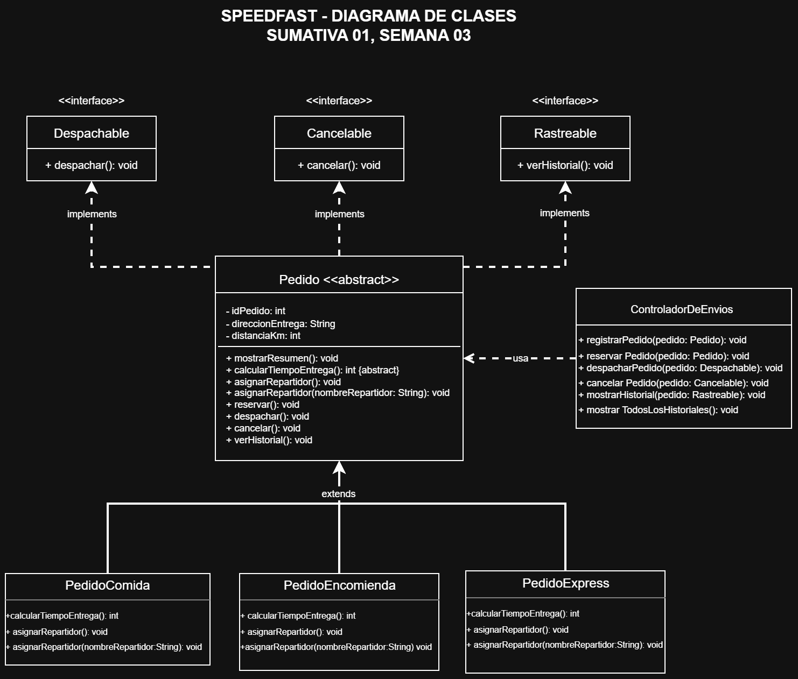

# SpeedFast - Semana 3

## Descripción

SpeedFast es un sistema de gestión de pedidos desarrollado en Java aplicando principios de Programación Orientada a Objetos.

El sistema permite gestionar distintos tipos de pedidos, asignar repartidores, calcular tiempos estimados de entrega, reservar pedidos, despacharlos, cancelarlos y consultar su historial de operaciones.

La solución integra los conceptos trabajados durante las semanas 1, 2 y 3:

- Herencia.
- Polimorfismo.
- Sobrescritura de métodos.
- Sobrecarga de métodos.
- Clases abstractas.
- Interfaces.
- Desacoplamiento de responsabilidades.
- Reutilización de código.

---

## Tipos de pedido

El sistema trabaja con tres tipos de pedido:

### PedidoComida

Representa pedidos de comida.

El tiempo estimado de entrega se calcula de la siguiente forma:

```text
15 minutos base + 2 minutos por kilómetro
```

Además, la asignación automática considera un repartidor preparado para transportar alimentos mediante mochila térmica.

### PedidoEncomienda

Representa pedidos correspondientes a encomiendas.

El tiempo estimado se calcula mediante:

```text
20 minutos base + 1,5 minutos por kilómetro
```

El resultado se ajusta a un valor entero mediante redondeo.

La asignación de repartidor contempla la validación de peso y embalaje.

### PedidoExpress

Representa pedidos que requieren una entrega rápida.

El cálculo utiliza:

```text
10 minutos base
```

Si la distancia es superior a 5 kilómetros:

```text
10 minutos + 5 minutos adicionales
```

La asignación automática busca un repartidor disponible para una entrega express.

---

## Estructura del proyecto

```text
cl.speedfast
│
├── Main.java
├── Pedido.java
├── PedidoComida.java
├── PedidoEncomienda.java
├── PedidoExpress.java
│
├── interfaces
│   ├── Cancelable.java
│   ├── Despachable.java
│   └── Rastreable.java
│
└── gestores
    └── ControladorDeEnvios.java
```

---

## Clase abstracta Pedido

`Pedido` corresponde a la clase base abstracta del sistema.

Contiene información y comportamiento común que puede ser reutilizado por los diferentes tipos de pedido.

Entre sus principales atributos se encuentran:

- Identificador del pedido.
- Dirección de entrega.
- Distancia en kilómetros.
- Repartidor asignado.
- Estado de reserva.
- Estado de despacho.
- Estado de cancelación.
- Historial de operaciones.

La clase implementa el método común:

```java
mostrarResumen()
```

y declara el método abstracto:

```java
calcularTiempoEntrega()
```

Cada subclase implementa este último método de acuerdo con sus propias reglas de negocio.

---

## Herencia

Las clases:

```text
PedidoComida
PedidoEncomienda
PedidoExpress
```

heredan de la clase abstracta:

```text
Pedido
```

Esto permite reutilizar atributos y comportamientos comunes sin duplicar código.

Cada subclase conserva además sus propias características y reglas para calcular el tiempo de entrega y asignar un repartidor.

---

## Polimorfismo

El sistema utiliza polimorfismo mediante sobrescritura y sobrecarga de métodos.

### Sobrescritura

Cada tipo de pedido redefine:

```java
asignarRepartidor()
```

para aplicar una lógica apropiada según el tipo de entrega.

También implementa de forma diferenciada:

```java
calcularTiempoEntrega()
```

### Sobrecarga

El sistema permite asignar repartidores de manera automática:

```java
asignarRepartidor()
```

o de manera manual:

```java
asignarRepartidor(String nombreRepartidor)
```

De esta forma, un mismo comportamiento puede adaptarse a diferentes situaciones.

---

## Interfaces

El sistema utiliza tres interfaces para separar responsabilidades específicas.

### Despachable

Define la operación:

```java
void despachar();
```

Permite tratar un pedido como un elemento capaz de ser despachado sin depender de su clase concreta.

### Cancelable

Define la operación:

```java
void cancelar();
```

Permite gestionar la cancelación de los pedidos de forma desacoplada.

### Rastreable

Define la operación:

```java
void verHistorial();
```

Permite consultar las operaciones registradas para un pedido.

La clase abstracta `Pedido` implementa estas tres interfaces y sus subclases heredan estas capacidades.

---

## ControladorDeEnvios

La clase `ControladorDeEnvios` se encarga de coordinar operaciones relacionadas con la gestión de los pedidos.

Entre sus responsabilidades se encuentran:

- Registrar pedidos.
- Reservar pedidos.
- Despachar pedidos.
- Cancelar pedidos.
- Mostrar el historial de un pedido.
- Mostrar el historial de todos los pedidos registrados.

Para reducir el acoplamiento, varias de sus operaciones reciben referencias de las interfaces correspondientes.

Por ejemplo:

```java
despacharPedido(Despachable pedido)
cancelarPedido(Cancelable pedido)
mostrarHistorial(Rastreable pedido)
```

De esta manera, el controlador depende de capacidades definidas mediante interfaces y no de implementaciones concretas.

---

## Historial de operaciones

Cada pedido mantiene un historial utilizando un `ArrayList<String>`.

El historial puede registrar eventos como:

```text
Pedido creado.
Repartidor asignado.
Pedido reservado.
Pedido despachado.
Pedido cancelado.
```

Esto permite consultar las acciones realizadas sobre cada pedido durante la ejecución del sistema.

---

## Simulación en Main

La clase `Main` crea y procesa tres casos diferentes.

### Caso 1 - Pedido de comida

- Asignación automática de repartidor.
- Cálculo del tiempo de entrega.
- Reserva del pedido.
- Despacho del pedido.
- Consulta del historial.

### Caso 2 - Pedido de encomienda

- Asignación manual de repartidor.
- Cálculo del tiempo de entrega.
- Reserva del pedido.
- Despacho del pedido.
- Intento de cancelación después del despacho.
- Consulta del historial.

### Caso 3 - Pedido express

- Asignación automática de repartidor.
- Cálculo del tiempo de entrega.
- Reserva del pedido.
- Cancelación del pedido.
- Consulta del historial.

La simulación permite comprobar los distintos comportamientos de las clases y las reglas asociadas al estado de cada pedido.

---

## Escalabilidad

La estructura del sistema permite incorporar nuevos tipos de pedido sin modificar completamente el funcionamiento existente.

Por ejemplo, podría agregarse una nueva clase:

```text
PedidoFarmacia
```

que herede de `Pedido` e implemente su propia lógica para:

```java
calcularTiempoEntrega()
asignarRepartidor()
```

Las operaciones comunes de reserva, despacho, cancelación e historial podrían seguir reutilizándose desde la clase base.

Además, el uso de interfaces permite incorporar nuevas clases que implementen capacidades como `Despachable`, `Cancelable` o `Rastreable` sin modificar el funcionamiento general del controlador.

---

## Reutilización

La reutilización se consigue concentrando los atributos y comportamientos comunes en la clase abstracta `Pedido`.

Las subclases reutilizan funcionalidades como:

- Reserva.
- Despacho.
- Cancelación.
- Registro del historial.
- Datos generales del pedido.
- Resumen del pedido.
- Registro del repartidor.

Solo los comportamientos que cambian según el tipo de pedido se especializan en las clases derivadas.

Las interfaces también permiten reutilizar operaciones desde otras clases sin depender directamente de una implementación específica.

---

## Mantenibilidad

La solución distribuye las responsabilidades entre diferentes componentes:

- `Pedido` administra los datos y comportamientos comunes.
- `PedidoComida`, `PedidoEncomienda` y `PedidoExpress` contienen las reglas particulares de cada tipo de entrega.
- Las interfaces `Despachable`, `Cancelable` y `Rastreable` definen capacidades independientes.
- `ControladorDeEnvios` coordina las operaciones del sistema.
- `Main` realiza la simulación y demuestra el funcionamiento de las distintas clases.

Esta separación reduce la dependencia entre componentes y facilita realizar modificaciones sin afectar innecesariamente otras partes del proyecto.

Por ejemplo, una modificación en la forma de calcular el tiempo de un `PedidoExpress` puede realizarse directamente en esa clase sin modificar la lógica de `PedidoComida`, `PedidoEncomienda` o `ControladorDeEnvios`.

---

## Diagrama de clases

El siguiente diagrama representa la estructura principal del sistema y las relaciones de herencia, abstracción e implementación de interfaces.



---

## Tecnologías utilizadas

- Java.
- IntelliJ IDEA.
- Git.
- GitHub.

---

## Autor

Cristofer Medel