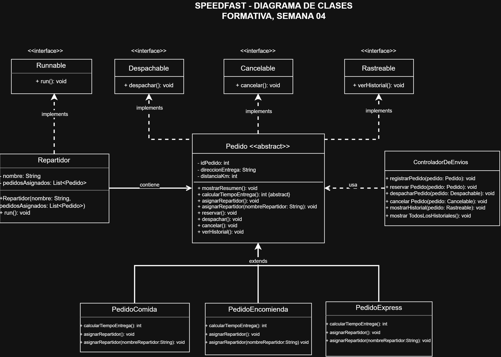

# SpeedFast - Semana 4

## Descripción

SpeedFast es un sistema de gestión de pedidos desarrollado en Java aplicando principios de Programación Orientada a Objetos y programación concurrente.

Durante la Semana 4, el sistema incorpora ejecución multihilo para simular a varios repartidores realizando entregas de manera simultánea.

La solución reutiliza la estructura desarrollada anteriormente, compuesta por una clase abstracta `Pedido`, diferentes tipos de pedidos, interfaces y un controlador de envíos.

En esta versión se incorporan principalmente los siguientes conceptos:

- Programación concurrente.
- Hilos de ejecución.
- Interfaz `Runnable`.
- `ExecutorService`.
- Ejecución de múltiples tareas en paralelo.
- `Thread.sleep()`.
- Manejo de `InterruptedException`.
- Polimorfismo.
- Herencia.
- Clases abstractas.
- Interfaces.
- Separación de responsabilidades.

---

## Tipos de pedido

El sistema mantiene tres tipos de pedido:

### PedidoComida

Representa pedidos de comida.

El tiempo estimado de entrega se calcula mediante:

```text
15 minutos base + 2 minutos por kilómetro
```

La asignación de repartidor contempla la preparación necesaria para transportar alimentos.

### PedidoEncomienda

Representa pedidos correspondientes a encomiendas.

El tiempo estimado se calcula mediante:

```text
20 minutos base + 1,5 minutos por kilómetro
```

El resultado se redondea a un valor entero.

La asignación contempla la validación de peso y embalaje.

### PedidoExpress

Representa pedidos que requieren una entrega rápida.

El cálculo considera:

```text
10 minutos base
```

Si la distancia supera los 5 kilómetros:

```text
10 minutos + 5 minutos adicionales
```

---

## Estructura del proyecto

```text
cl.speedfast
│
├── Main.java
├── Pedido.java
├── PedidoComida.java
├── PedidoEncomienda.java
├── PedidoExpress.java
├── Repartidor.java
│
├── interfaces
│   ├── Cancelable.java
│   ├── Despachable.java
│   └── Rastreable.java
│
└── gestores
    └── ControladorDeEnvios.java
```

---

## Clase abstracta Pedido

`Pedido` corresponde a la clase base abstracta del sistema.

Contiene la información y los comportamientos comunes que reutilizan los diferentes tipos de pedido.

Entre sus principales atributos se encuentran:

- Identificador del pedido.
- Dirección de entrega.
- Distancia en kilómetros.
- Repartidor asignado.
- Estado de reserva.
- Estado de despacho.
- Estado de cancelación.
- Historial de operaciones.

También contiene el método:

```java
mostrarResumen()
```

y declara el método abstracto:

```java
calcularTiempoEntrega()
```

Cada subclase implementa el cálculo de tiempo según sus propias reglas.

---

## Herencia y polimorfismo

Las clases:

```text
PedidoComida
PedidoEncomienda
PedidoExpress
```

heredan de:

```text
Pedido
```

Esto permite reutilizar atributos y comportamientos comunes.

El sistema utiliza referencias de tipo `Pedido` para trabajar con diferentes subclases sin depender directamente de una implementación concreta.

Por ejemplo, los pedidos asignados a los repartidores pueden corresponder a cualquiera de los tipos disponibles y ser procesados mediante una misma estructura.

---

## Interfaces

El sistema mantiene tres interfaces para representar capacidades independientes.

### Despachable

Define:

```java
void despachar();
```

### Cancelable

Define:

```java
void cancelar();
```

### Rastreable

Define:

```java
void verHistorial();
```

La clase abstracta `Pedido` implementa estas interfaces y sus subclases heredan dichas capacidades.

---

## ControladorDeEnvios

La clase `ControladorDeEnvios` coordina diferentes operaciones relacionadas con los pedidos.

Entre sus responsabilidades se encuentran:

- Registrar pedidos.
- Reservar pedidos.
- Despachar pedidos.
- Cancelar pedidos.
- Consultar el historial.
- Mostrar todos los historiales registrados.

El controlador utiliza referencias de las interfaces correspondientes para reducir el acoplamiento entre los componentes.

---

## Clase Repartidor

La clase `Repartidor` representa a un repartidor encargado de procesar una lista de pedidos.

Implementa la interfaz:

```java
Runnable
```

Esto permite que cada repartidor sea ejecutado como una tarea independiente dentro de un hilo.

Cada repartidor contiene:

- Un nombre.
- Una lista de pedidos asignados.

Al crear un repartidor, sus pedidos quedan asociados a su nombre.

El método:

```java
run()
```

recorre secuencialmente los pedidos asignados y simula el proceso de entrega.

---

## Simulación de tiempo de entrega

Durante la ejecución de cada repartidor se utiliza:

```java
Thread.sleep()
```

para simular el tiempo requerido para realizar una entrega.

El tiempo de espera se genera aleatoriamente para cada pedido.

Esto permite observar diferentes órdenes de finalización entre los repartidores durante cada ejecución del programa.

---

## Manejo de interrupciones

El uso de `Thread.sleep()` puede generar una excepción:

```java
InterruptedException
```

El sistema captura esta excepción y restaura el estado de interrupción mediante:

```java
Thread.currentThread().interrupt();
```

De esta manera, un repartidor puede finalizar su ejecución de forma controlada si su hilo es interrumpido.

---

## Ejecución concurrente

La clase `Main` crea seis pedidos y los distribuye entre tres repartidores:

```text
Camila
├── Pedido #101
└── Pedido #102

Luis
├── Pedido #103
└── Pedido #104

Daniela
├── Pedido #105
└── Pedido #106
```

Cada repartidor procesa sus dos pedidos de manera secuencial.

Sin embargo, los tres repartidores se ejecutan simultáneamente mediante:

```java
ExecutorService
```

El sistema utiliza un pool fijo de tres hilos:

```java
Executors.newFixedThreadPool(3)
```

y ejecuta cada repartidor como una tarea independiente.

---

## Finalización controlada

Una vez enviadas las tareas al `ExecutorService`, se utiliza:

```java
shutdown()
```

para indicar que no se recibirán nuevas tareas.

Posteriormente:

```java
awaitTermination()
```

permite que la aplicación espere hasta que los repartidores terminen sus entregas.

Si la ejecución supera el tiempo máximo definido, el sistema puede solicitar la interrupción de las tareas mediante:

```java
shutdownNow()
```

Esto permite realizar un cierre controlado de la simulación.

---

## Ejemplo de concurrencia

Durante una ejecución es posible obtener una salida similar a:

```text
[Repartidor: Daniela] Entregando PedidoEncomienda #105...
[Repartidor: Luis] Entregando PedidoExpress #103...
[Repartidor: Camila] Entregando PedidoComida #101...

[Repartidor: Luis] Pedido #103 entregado.
[Repartidor: Daniela] Pedido #105 entregado.
[Repartidor: Camila] Pedido #101 entregado.
```

El orden puede variar en cada ejecución debido a los tiempos de espera aleatorios.

Esto permite observar que los repartidores trabajan de forma concurrente y no uno después del otro.

---

## Historial de pedidos

Cada pedido mantiene un historial mediante un `ArrayList<String>`.

En la simulación se registran eventos como:

```text
Pedido creado.
Repartidor asignado.
```

Al finalizar la ejecución, el controlador permite mostrar el historial correspondiente a todos los pedidos registrados.

---

## Separación de responsabilidades

La solución distribuye las responsabilidades de la siguiente manera:

- `Pedido` administra los datos y comportamientos comunes de los pedidos.
- `PedidoComida`, `PedidoEncomienda` y `PedidoExpress` implementan las reglas particulares de cada tipo.
- `Repartidor` administra la ejecución de las entregas asignadas y funciona como tarea concurrente.
- Las interfaces `Despachable`, `Cancelable` y `Rastreable` representan capacidades independientes.
- `ControladorDeEnvios` coordina las operaciones relacionadas con los pedidos.
- `Main` configura y ejecuta la simulación concurrente mediante `ExecutorService`.

Esta organización permite mantener las responsabilidades separadas y facilita la incorporación de nuevas funcionalidades.

---

## Diagrama de clases

El diagrama de clases representa la estructura principal del sistema, incluyendo las relaciones entre `Pedido`, sus subclases, las interfaces, `ControladorDeEnvios` y `Repartidor`.



---

## Tecnologías utilizadas

- Java.
- IntelliJ IDEA.
- Programación multihilo.
- ExecutorService.
- Git.
- GitHub.

---

## Autor

Cristofer Medel